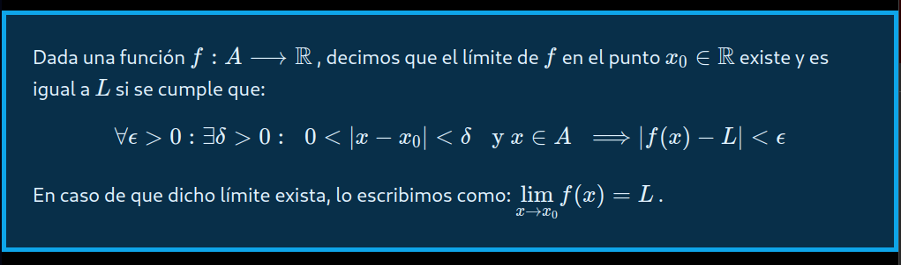
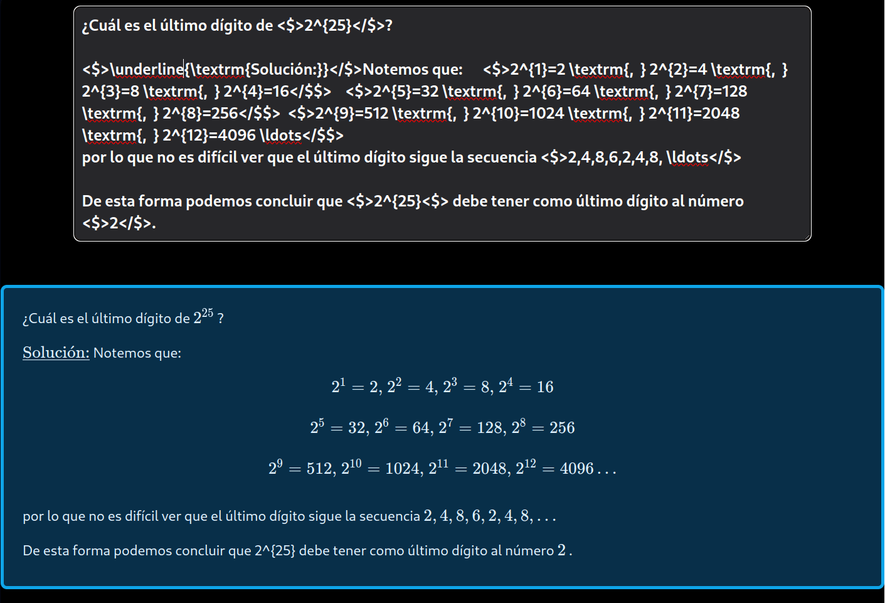
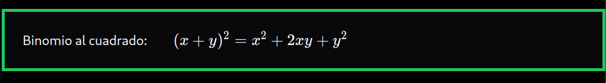

# React MathTex

## Install

```
npm i react-mathtex
```

## Usage

There are two ways to show content in LaTex format:

1. [MathText Component](#mathtext-component)
2. [LineTex Component](#linetex-component)


## MathText component

If the content has several lines with math parts into, you should use **MathTex** component. For example:

### Example 1

```javascript
import MathTex from "react-mathtex";

function Text() {
  const math =
    "Dada una función <$>f: A \\longrightarrow \\mathbb{R}</$>, decimos que el límite de <$>f</$> en el punto <$>x_0 \\in \\mathbb{R}</$> existe y es igual a <$>L</$> si se cumple que: \n <$>\\forall \\epsilon >0: \\exist \\delta >0: \\hspace{0.2cm} 0 < |x-x_0| < \\delta \\hspace{0.2cm} \\textrm{  y  } x \\in A \\hspace{0.2cm} \\Longrightarrow |f(x)-L| < \\epsilon</$$> \n En caso de que dicho límite exista, lo escribimos como: <$>\\displaystyle{\\lim_{x \\rightarrow x_0}} f(x) = L</$>.";

  return (
    <MathTex classname="w-full border-4 border-sky-500 bg-sky-950 text-lg text-sky-100 my-10 p-6">
      {math}
    </MathTex>
  );
}
```
The rendered output looks like this:




### Example 2: with textarea

```javascript
import MathTex from "react-mathtex";

function TextInput() {
  const math =
    "Dada una función <$>f: A \\longrightarrow \\mathbb{R}</$>, decimos que el límite de <$>f</$> en el punto <$>x_0 \\in \\mathbb{R}</$> existe y es igual a <$>L</$> si se cumple que: \n <$>\\forall \\epsilon >0: \\exist \\delta >0: \\hspace{0.2cm} 0 < |x-x_0| < \\delta \\hspace{0.2cm} \\textrm{  y  } x \\in A \\hspace{0.2cm} \\Longrightarrow |f(x)-L| < \\epsilon</$$> \n En caso de que dicho límite exista, lo escribimos como: <$>\\displaystyle{\\lim_{x \\rightarrow x_0}} f(x) = L</$>.";

  return (
    <>
      <textarea
        rows={10}
        className="w-5/6 bg-zinc-800 border-2 border-orange-500 text-xl font-bold text-white mt-4 p-2 rounded-lg"
        onChange={(e) => setContent(e.target.value)}
      />
      <MathTex classname="w-full border-4 border-sky-500 bg-sky-950 text-lg text-sky-100 mt-4 mb-20 p-6 rounded-lg">
        {content}
      </MathTex>
    </>
  );
}
```

The rendered output looks like this:




## LineTex component

If the content has one line with math parts into, you should use **LineTex** component. For example:

```javascript
import { LineTex } from "react-mathtex";

function Text() {
  const math =
    "Binomio al cuadrado: <$>\\hspace{0.5cm} (x+y)^2 = x^2 +2xy + y^2 </$>";

  return (
    <LineTex classname="w-full border-4 border-green-500 bg-zinc-950 text-lg text-zinc-50 my-10 p-6">
      {math}
    </LineTex>
  );
}
```

The rendered output looks like this:


